# 💰 Financeiro Pessoal

> Sistema de controle financeiro pessoal com inteligência artificial, desenvolvido em Python com interface gráfica moderna.

---

## Visão Geral

O **Financeiro Pessoal** é um app desktop completo para controle de finanças, com suporte a gastos, receitas, dívidas, investimentos, parcelas e gastos fixos — tudo integrado a um assistente de IA para análises e dicas personalizadas.

---

## Telas do sistema

### Configuração inicial

Na primeira execução, um onboarding guiado apresenta todas as funcionalidades e solicita a chave de API do Groq para ativar o assistente de IA.

| Boas-vindas | Gastos | Dívidas |
|:-----------:|:------:|:-------:|
|  | 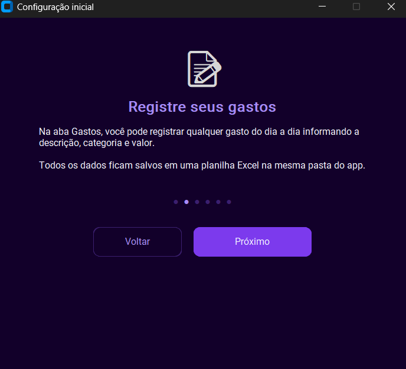 | 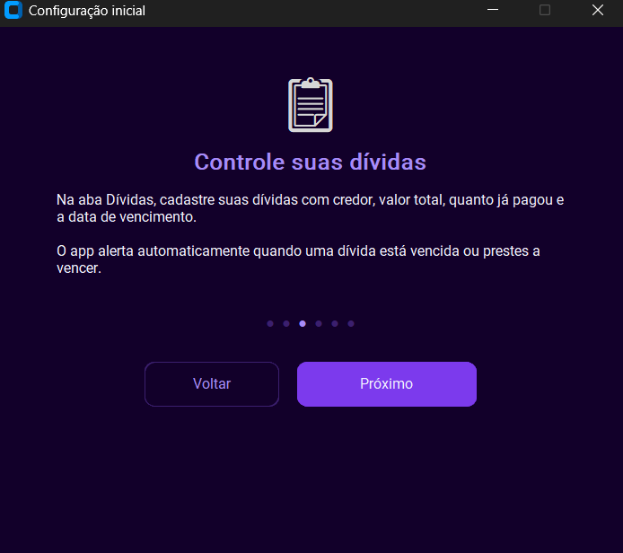 |

| Gráficos | Assistente IA | Configuração de API |
|:--------:|:-------------:|:-------------------:|
| 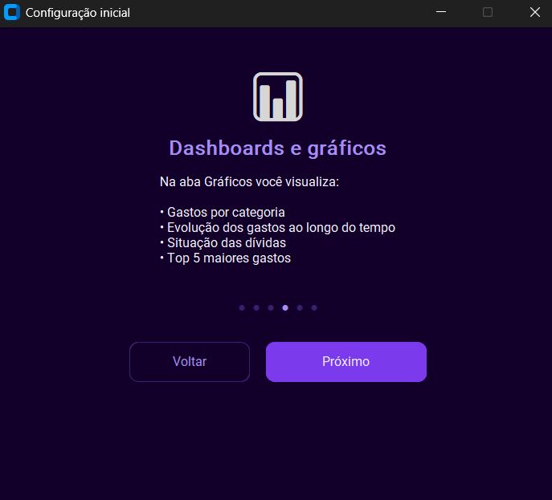 | 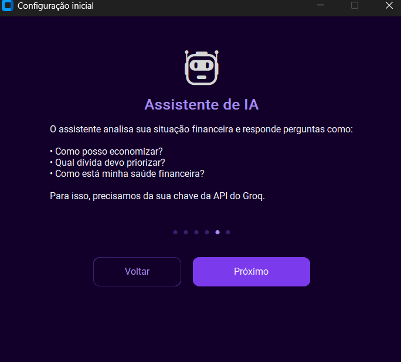 | 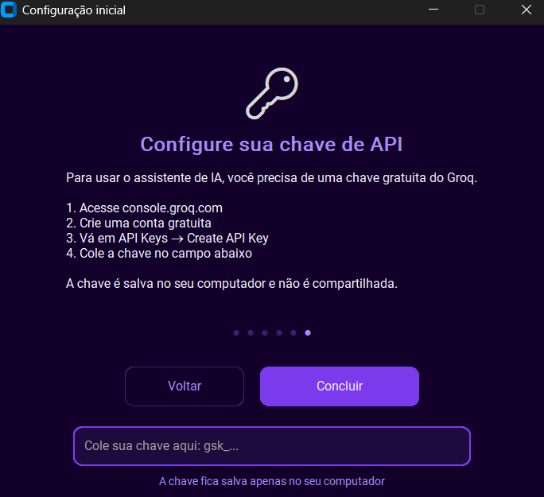 |

---

### Painel Financeiro

Visão geral do mês atual com cards de gastos, receitas, saldo e dívidas pendentes. Inclui meta de economia com barra de progresso que muda de cor conforme o limite se aproxima.

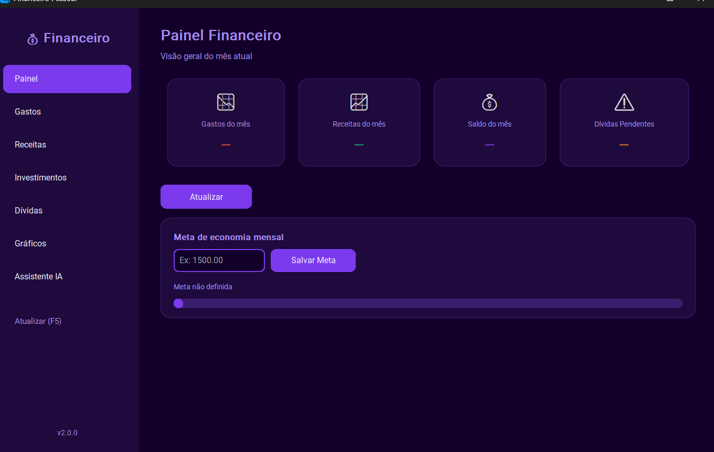

---

### Gastos

Registro de gastos com campo de data manual e atalhos rápidos (Hoje, Ontem, Anteontem). Filtros por categoria e período. Gráfico de evolução com alternância entre visão semanal e mensal. Seção dedicada para gastos fixos recorrentes e compras parceladas.

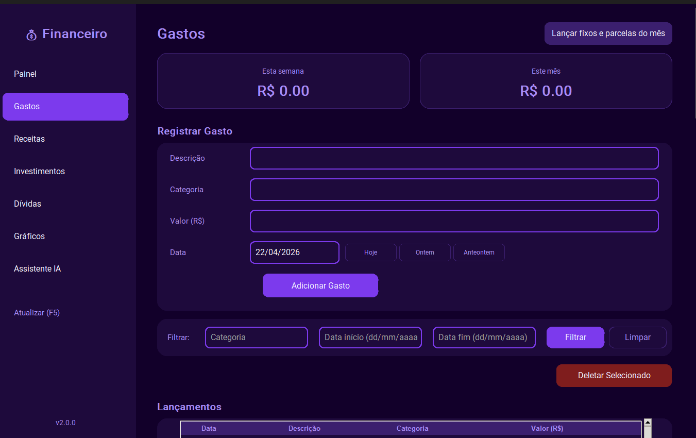

---

### Receitas

Cadastro de receitas com sugestões rápidas de categoria: Salário, Freelancer, Investimento, Presente e Outros.

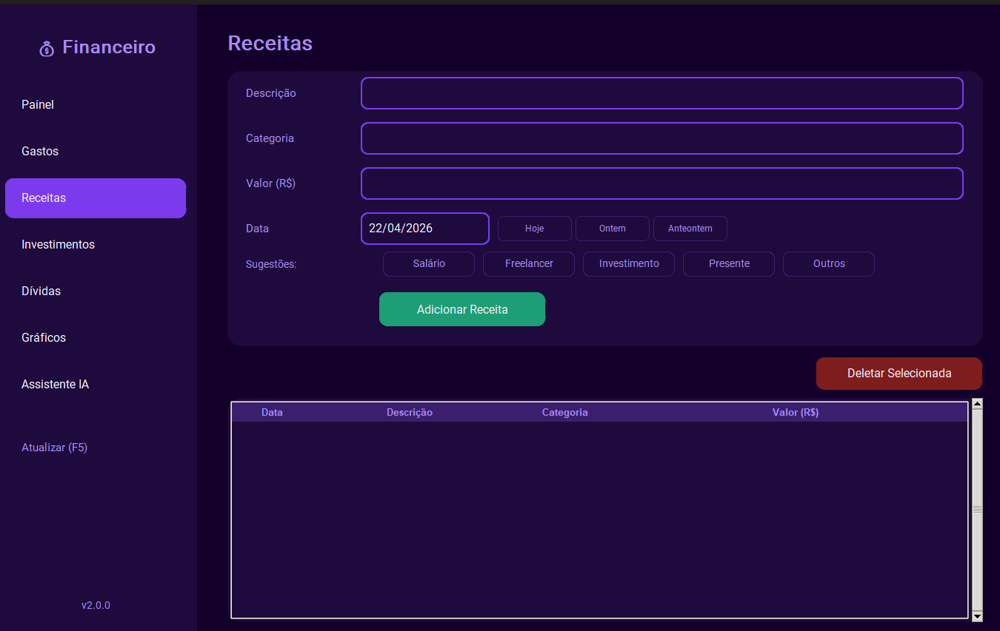

---

### Investimentos

Acompanhamento de investimentos com cards de total investido, valor do mês e número de categorias. Gráfico de evolução com filtro mensal/anual e pizza por categoria.

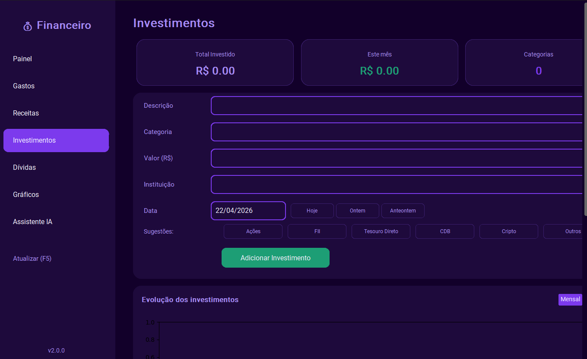

---

### Dívidas

Controle de dívidas com credor, valor total, valor pago, vencimento e status automático (Pendente/Quitada). Alertas automáticos para dívidas vencidas ou próximas do vencimento.

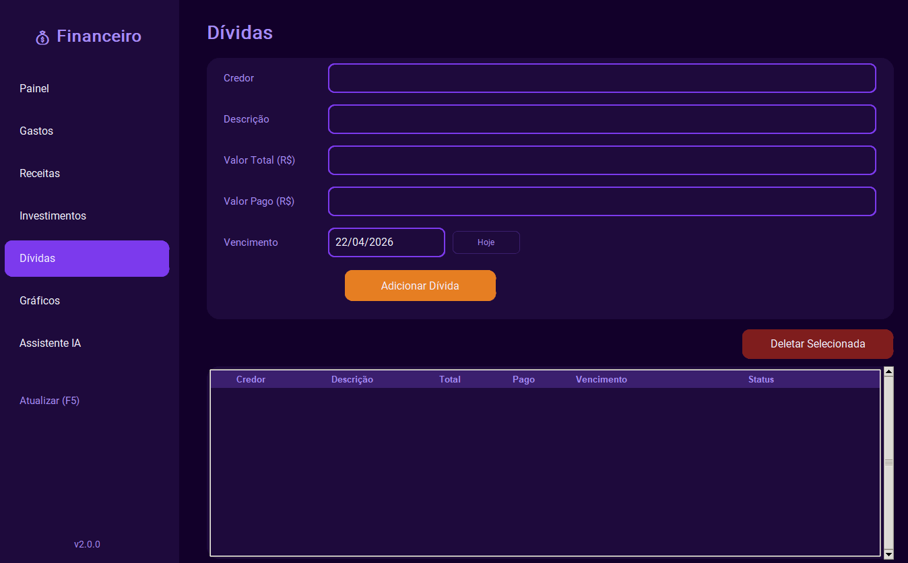

---

### Gráficos e Dashboards

4 dashboards em uma única tela: gastos por categoria, dívidas pago vs pendente, evolução dos gastos e top 5 maiores gastos.

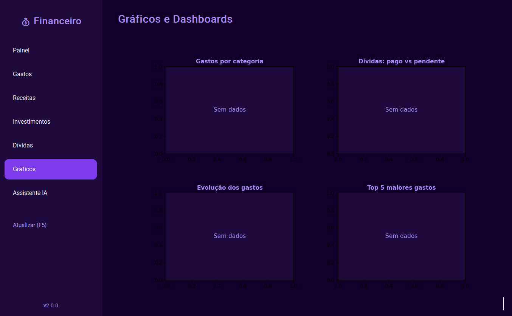

---

### Assistente Financeiro IA

Chat com IA alimentado pelo modelo Llama 3 via Groq. Analisa automaticamente sua situação financeira ou responde perguntas específicas em português.

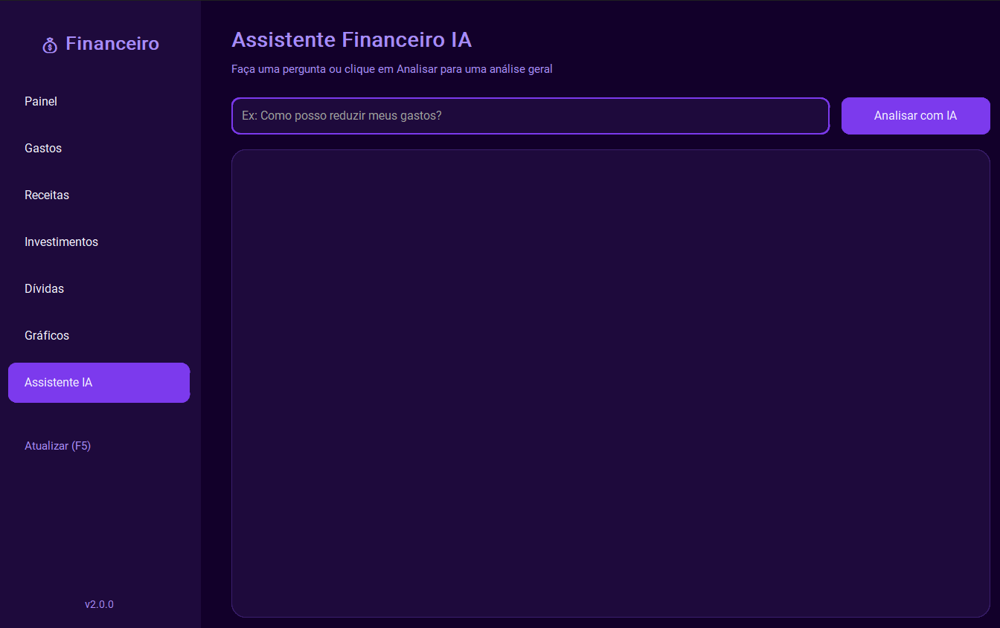

---

## Funcionalidades

- **Painel geral** com resumo do mês atual (gastos, receitas, saldo, dívidas)
- **Meta de economia** mensal com barra de progresso colorida
- **Gastos** com data manual, filtros por categoria e período
- **Gastos fixos** com lançamento automático mensal (aluguel, água, luz, internet...)
- **Compras parceladas** com controle de parcelas pagas e restantes
- **Receitas** com categorias rápidas
- **Dívidas** com alertas de vencimento automáticos
- **Investimentos** com acompanhamento por categoria e período
- **4 gráficos** interativos no dashboard
- **Assistente IA** integrado ao Groq (gratuito)
- **Dados salvos** em planilha Excel (.xlsx)
- **Atualização** com F5 ou botão na sidebar
- **Onboarding** guiado para novos usuários

---

## Tecnologias

| Tecnologia | Uso |
|---|---|
| Python 3.11+ | Linguagem principal |
| CustomTkinter | Interface gráfica moderna |
| openpyxl | Leitura e escrita de Excel |
| matplotlib | Gráficos e dashboards |
| requests | Integração com API do Groq |
| python-dotenv | Gerenciamento de variáveis de ambiente |
| PyInstaller | Geração do executável |

---

## Arquitetura

O projeto segue uma arquitetura em 4 camadas:

```
financeiro/
├── core/                  # Regras de negócio
│   ├── models.py          # Dataclasses tipadas
│   ├── exceptions.py      # Erros customizados
│   └── services/          # Lógica por domínio
├── infra/                 # Acesso a dados
│   ├── excel.py           # Leitura/escrita Excel
│   ├── config.py          # Configurações e API key
│   └── ia.py              # Integração Groq
├── ui/                    # Interface gráfica
│   ├── theme.py           # Design system centralizado
│   ├── components/        # Widgets reutilizáveis
│   └── telas/             # Abas do app
├── app.py                 # Janela principal
├── onboarding.py          # Tela de boas-vindas
└── main.py                # Ponto de entrada
```

---

## Instalação e uso

### Pré-requisitos

- Python 3.11 ou superior
- Conta gratuita no [Groq](https://console.groq.com) para usar o assistente de IA

### Instalação

```bash
# Clone o repositório
git clone https://github.com/seu-usuario/financeiro-pessoal.git
cd financeiro-pessoal

# Crie e ative o ambiente virtual
python -m venv venv
venv\Scripts\activate  # Windows
source venv/bin/activate  # Linux/Mac

# Instale as dependências
pip install -r requirements.txt
```

### Executando

```bash
python main.py
```

Na primeira execução, o onboarding será aberto automaticamente para configurar sua chave de API do Groq.

---

## Gerando o executável

```bash
pip install pyinstaller

pyinstaller --noconfirm --onedir --windowed \
  --collect-all customtkinter \
  --collect-all matplotlib \
  --name "FinanceiroPessoal" main.py
```

O executável estará em `dist/FinanceiroPessoal/`. Compacte a pasta em `.zip` para distribuir.

---

## Configuração da API

O sistema usa o [Groq](https://console.groq.com) como provedor de IA — é gratuito e não requer cartão de crédito.

1. Acesse [console.groq.com](https://console.groq.com)
2. Crie uma conta gratuita
3. Vá em **API Keys → Create API Key**
4. Cole a chave no campo exibido no onboarding do app

A chave é salva localmente em `%APPDATA%/FinanceiroPessoal/config.json` e nunca é compartilhada.

---
## Licença

Este projeto está sob a licença MIT. Veja o arquivo [LICENSE](LICENSE) para mais detalhes.